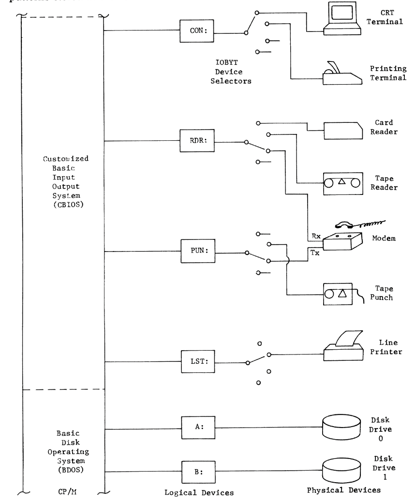

# Chapter 3: The CP/M Based Computer

By Sheel Shah

---

## Logical names

 - Logical names simplify the interaction between the computer operator and the physical devices.
 - Logical names provide a convenient way to access and work with hardware components.
 - Ex: CRT stands for cathode ray tube and is better than typing out omputer's operator's console video display terminal.

---

## Physical entities

 - Physical devices are actual physical devices like a keyboard.
 - Physical devices are represented by logical names in the CP/M operating system.
 - CP/M's design simplifies file and device accesses, reducing the programmer's burden.
 - Examples: LPTs (line printers) and the two disk drives.

---

## Selecting I/O Devices

 - **IOBYT Device Selection**: Four selector switches for I/O device selection allows dynamic switching between different I/O devices.
 - CP/M provides methods for altering device selections.
 - In the book they use CRT (as CON) and LPT (as LST)

---

## Selecting I/O Devices (cont.)

 

---

# Questions?